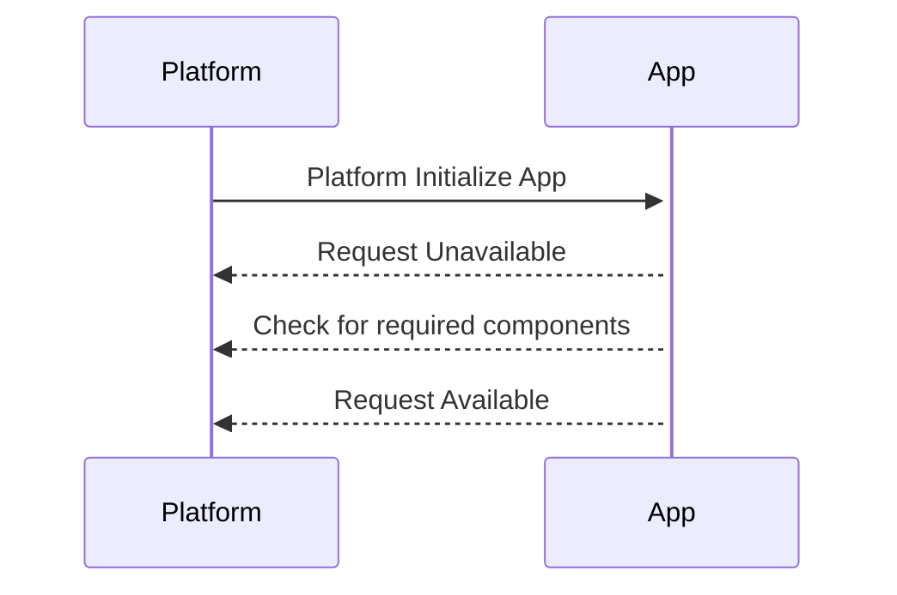
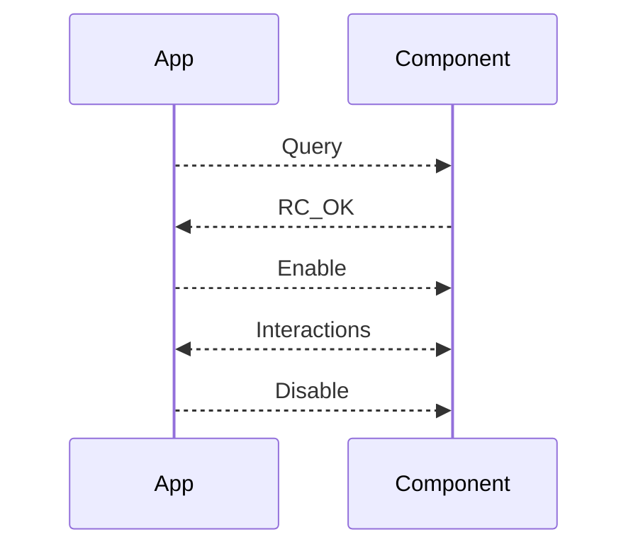

# CUSS2.ts

A TypeScript SDK for the Common Use Self-Service version 2 (CUSS2) platform that facilitates developing applications for
airline self-service kiosks.

[](https://opensource.org/licenses/MIT)

## Overview

CUSS2.ts provides a robust TypeScript interface to interact with the CUSS2 platform, enabling developers to create
applications for self-service check-in, self-tagging, and self bag-drop terminals in the airline industry. This SDK
handles platform state management, WebSocket communication, and provides a clean API for interacting with various
peripheral devices.

## Installation

This is a Deno project. You can import it directly in your Deno application:

```typescript
import { Cuss2 } from "jsr:@cuss/cuss2-ts@latest";
```

## Quick Start

```typescript
import { Cuss2 } from "jsr:@cuss/cuss2-ts@latest";

// Connect to the CUSS2 platform
const cuss2 = await Cuss2.connect(
  "wss://cuss-platform.example.com",
  "device-id",
  "client-id",
  "client-secret",
  "https://oauth.example.com/token", // Optional token URL
);

// Request available state
await cuss2.requestAvailableState();

// Enable barcode reader and handle scan data
await cuss2.barcodeReader.enable();
cuss2.barcodeReader.on("data", (data) => {
  console.log("Barcode scanned:", data);
});

// Print a boarding pass
await cuss2.boardingPassPrinter.enable();
const printData = [/* your boarding pass data */];
await cuss2.boardingPassPrinter.send(printData);
```

## Features

- **Complete TypeScript Support**: Fully typed interfaces for all CUSS2 components and responses
- **WebSocket Communication**: Manages WebSocket lifecycle with the CUSS2 platform
- **OAuth Authentication**: Handles authentication via OAuth
- **State Management**: Easily transition through application states (INITIALIZE, UNAVAILABLE, AVAILABLE, ACTIVE)
- **Component Management**: Interface with peripheral devices like printers, readers, and input devices
- **Event-Driven Architecture**: Subscribe to events for state changes and device data
- **Async/Await Support**: Modern Promise-based API
- **Deno-First Development**: Built specifically for the Deno runtime

## Core Concepts

### Application States

CUSS2 applications transition through defined states:

- `INITIALIZE`: Initial startup state
- `UNAVAILABLE`: Application is loaded but not available for passenger use
- `AVAILABLE`: Application is ready for passenger use
- `ACTIVE`: Application is actively being used by a passenger

```typescript
// Request state transitions
await cuss2.requestUnavailableState();
await cuss2.requestAvailableState();
await cuss2.requestActiveState();
```

## Typical Application Startup



## Example state events

```ts
// CUSS Transitions

// Instantiating a connection
const cuss2 = await Cuss2.connect(
  cuss2URL,
  oauthURL,
  deviceID,
  clientId,
  clientSecret,
);

// Moving to unavailable
await cuss2.requestUnavailableState();

// checking for a ATB Printer
if (cuss2?.boardingPassPrinter) {
  // Moving to Available
  await cuss2.requestAvailableState();
}

// Listen for activation events
cuss2.on("activated", () => {
  console.log("Application is active");
});

// Listen for deactivation events
cuss2.on("deactivated", () => {
  console.log("Application is no longer active");
});
```

### Interacting with CUSS Devices

This library offers a streamlined, intuitive interface for CUSS device interaction, enabling developers to build
sophisticated platform integrations without unnecessary boilerplate code.



#### Media Outputs

```ts
const cuss2 = await Cuss2.connect(cuss2URL, oauthURL, deviceID, clientId, clientSecret);

// query ATB
const res = await cuss2?.boardingPassPrinter.query();

// validate component state
if (res.meta.componentState !== ComponentState.READY) {
  console.log("Component is not ready");
}
else {
  // Enable component
  await cuss2.boardingPassPrinter.enable();

  // SETUP ATB
  await cuss2.boardingPassPrinter.setupITPS(["LT...", "TT..."]);

  // Print boarding pass
  await cuss2.boardingPassPrinter.printITPS("CP...");

  // Disable component
  await cuss2.boardingPassPrinter.disable();
}
```

### Components Collection

The `components` property provides access to all discovered components:

```typescript
// Access the components collection after initialization
const components = cuss2.components;

// Iterate through all components
Object.entries(components).forEach(([id, component]) => {
  console.log(`Component ${id}:`, {
    type: component.componentType,
    name: component.componentName,
    state: component.componentState,
    location: component.componentLocation
  });
});
```

Components are automatically discovered during initialization and stored in the `components` object keyed by their component ID.

### Component Types

The SDK supports all CUSS2 peripherals:

- **Printers**: `BagTagPrinter`, `BoardingPassPrinter`
- **Readers**: `BarcodeReader`, `CardReader`, `DocumentReader`, `RFID`
- **Input/Biometric**: `Biometric`, `Camera`, `Keypad`
- **Baggage**: `Scale`, `InsertionBelt`, `VerificationBelt`, `ParkingBelt`, `BHS`, `AEASBD`
- **Feedback**: `Announcement`, `Illumination`, `Headset`

### Event Handling

```typescript
// Listen for state changes
cuss2.on("stateChange", (stateChange) => {
  console.log(`State changed from ${stateChange.previous} to ${stateChange.current}`);
});

// Listen for component data
cuss2.barcodeReader.on("data", (data) => {
  console.log("Barcode data:", data);
});

// Listen for component state changes
cuss2.on("componentStateChange", (component) => {
  console.log(`Component ${component.id} state changed to ${component._componentState}`);
});
```

## Component Usage Examples

### Barcode Reader

```typescript
// Enable barcode reader
await cuss2.barcodeReader.enable();

// Set up event listener for scanned data
cuss2.barcodeReader.on("data", (data) => {
  console.log("Barcode scanned:", data);
});

// Disable when done
await cuss2.barcodeReader.disable();
```

### Printing

```typescript
// Enable printer
await cuss2.boardingPassPrinter.enable();

// Create print data
const printData = [{
  data: "LT01...",
  dsTypes: [CUSSDataTypes.ITPS],
}];

// Send print job
await cuss2.boardingPassPrinter.setup(printData);

// Disable when done
await cuss2.boardingPassPrinter.disable();
```

## Advanced Usage

### Environment Information

The `environment` property provides access to platform environment details:

```typescript
// Access environment information after connection
const environment = cuss2.environment;

console.log("Device ID:", environment.deviceID);
console.log("Platform ID:", environment.platformID);
console.log("Platform Version:", environment.cuss2Version);
console.log("Location:", environment.locationCode);
console.log("Capabilities:", environment.platformCapabilities);
```

The environment object includes:
- `deviceID`: Unique identifier for the device
- `platformID`: Platform implementation identifier
- `cuss2Version`: Version of the CUSS2 standard
- `locationCode`: IATA location code
- `platformCapabilities`: Available platform features
- And more platform-specific information

### Required Components

Mark components as required to automatically manage application state:

```typescript
// Mark barcode reader as required
cuss2.barcodeReader.required = true;

// The SDK will automatically try to transition to UNAVAILABLE state
// if any required component becomes unavailable
```

### Component Polling

Components can be configured to automatically poll until ready:

```typescript
// Set a custom polling interval (milliseconds)
cuss2.barcodeReader.pollingInterval = 5000;

// Start polling until component is ready
cuss2.barcodeReader.pollUntilReady();
```

## Building and Testing

```bash
# Build the project
deno task build

# Run tests
deno test
```

## JavaScript Browser Version

A single-file JavaScript version is available for browser use. This version exposes a global `Cuss2` object that
contains all the functionality of the TypeScript SDK.

### Building the JavaScript Version

```bash
# Build the JavaScript browser bundle
deno task build
```

This will create a `/dist/cuss2.js` file that can be included in a browser application.

### Using the JavaScript Version

Include the bundled file in your HTML:

```html
<script src="dist/cuss2.js"></script>
```

Then use the global `Cuss2` object in your code:

```javascript
// Connect to the CUSS2 platform
const cuss2 = await Cuss2.connect(
  "wss://cuss-platform.example.com",
  "device-id",
  "client-id",
  "client-secret",
);

// Request available state
await cuss2.requestAvailableState();

// Enable barcode reader and handle scan data
await cuss2.barcodeReader.enable();
cuss2.barcodeReader.on("data", (data) => {
  console.log("Barcode scanned:", data);
});
```

All models and types from the TypeScript version are also available on the `Cuss2` object.

## Development

This project includes a `deno.json` configuration file with task definitions for building, testing, and documentation
generation.

```json
{
  "tasks": {
    "build": "deno run --allow-read --allow-write --allow-env --allow-run scripts/build.ts",
    "test": "deno test --allow-net --allow-read"
  }
}
```

## License

This project is licensed under the MIT License - see the LICENSE file for details.
